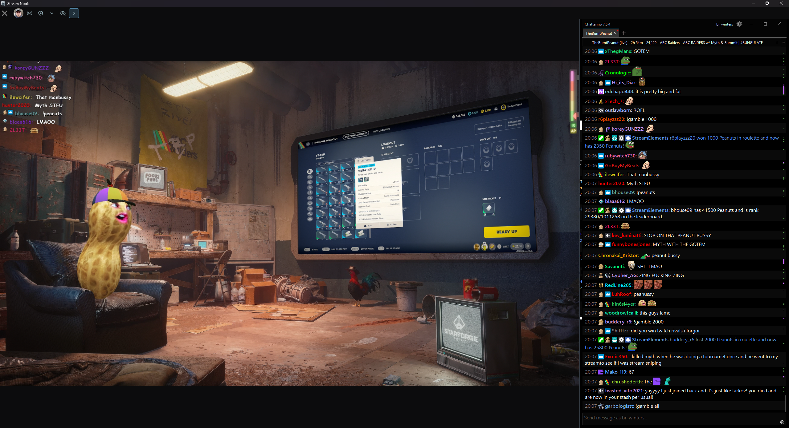
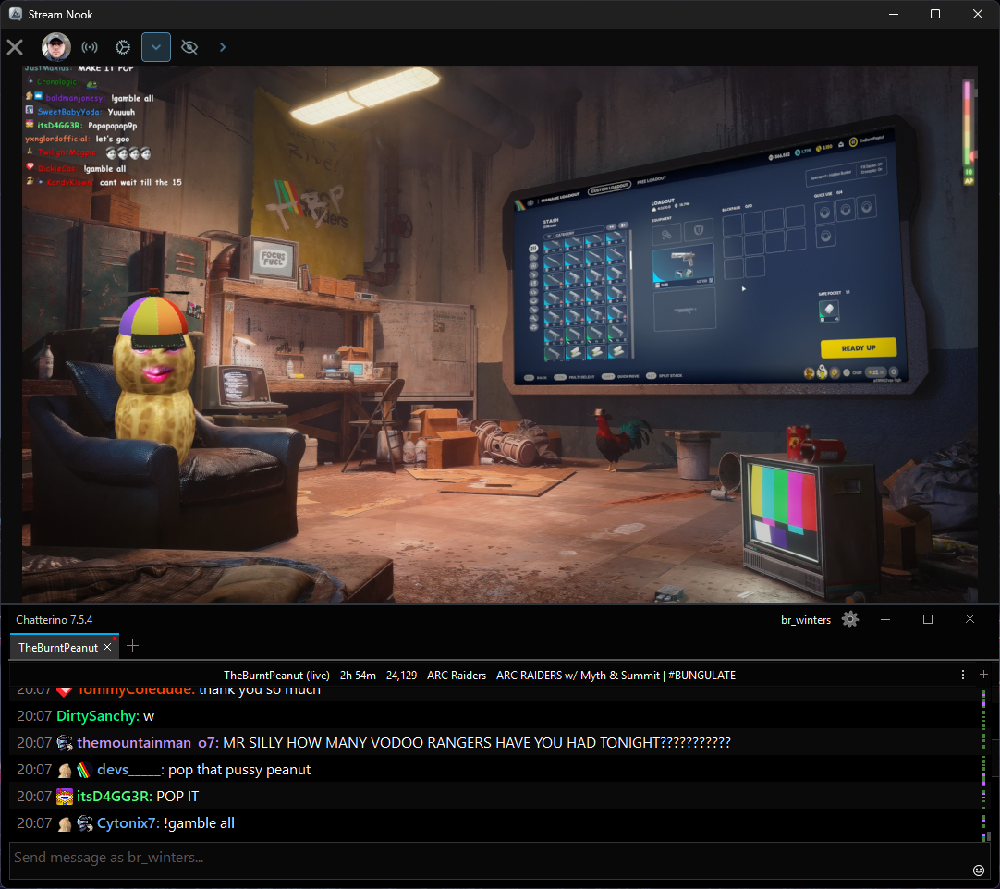
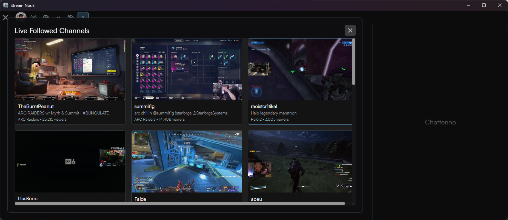

  

# Stream Nook

Stream Nook is a lightweight, integrated application designed to provide a seamless and enhanced streaming experience. It combines the power of `mpv` for video playback, `Streamlink` for reliable stream fetching, and `Chatterino` for a feature-rich chat client, all within a single, cohesive environment.

## Features

*   **Lightweight Streaming:** Enjoy high-quality streams with minimal resource usage by leveraging `mpv` as the video player.
*   **Robust Stream Fetching:** Powered by `Streamlink`, ensuring stable and consistent access to your favorite streams.
*   **Integrated Chat Experience:** Full integration with `Chatterino`, providing advanced chat features, custom emotes, and a responsive interface.
*   **Discord Rich Presence:** Share your current streaming activity with friends through Discord Rich Presence integration, displaying what you're watching directly on your Discord profile.
*   **Twitch Live Follows:** Log into your Twitch account to see an easy interface of who you follow on Twitch who is live, complete with stream previews.

---

## Screenshots

  

  

  

  

---

# Stream Nook and Dependencies Setup Guide

This guide provides a one-click PowerShell installer to quickly set up Stream Nook and its essential dependencies (Streamlink, mpv, and Chatterino) from scratch.

---

## 1. Using the PowerShell Installer

### Quick Start

1.  **Download the installer:**
    -   Save a copy of `StreamNook-Installer.ps1` to your PC.

2.  **Run it:**
    -   Right-click the `.ps1` file and select **“Run with PowerShell.”**
    -   Follow the step-by-step wizard that appears.

3.  **What the wizard does:**
    -   Automatically downloads the **latest** releases of:
        -   **mpv** (Video Player)
        -   **Streamlink**
        -   **Chatterino (7TV Edition)**
        -   **TTVLOL plugin**
        -   **Stream Nook**
    -   Guides you through configuration, including:
        -   Setting mpv as the video player.
        -   Adding Streamlink arguments.
        -   Enabling ad-free Twitch playback.

4.  **When finished:**
    -   Everything is installed and pre-configured.
    -   You can launch Stream Nook and start watching streams immediately.

---

## 2. Components Installed

| Component | Repository | Purpose |
| :--- | :--- | :--- |
| **mpv** | [shinchiro/mpv-winbuild-cmake](https://github.com/shinchiro/mpv-winbuild-cmake/releases/latest) | The media player used by Streamlink. |
| **Streamlink** | [streamlink/windows-builds](https://github.com/streamlink/windows-builds/releases) | The backend CLI that pipes Twitch streams to the player. |
| **Stream Nook** | [winters27/StreamNook](https://github.com/winters27/StreamNook/releases/latest) | The integrated application for a seamless streaming experience. |
| **TTVLOL Plugin** | [2bc4/streamlink-ttvlol](https://github.com/2bc4/streamlink-ttvlol/releases) | Removes Twitch ads by routing through custom proxies. |
| **Chatterino (7TV Edition)** | [SevenTV/chatterino7](https://github.com/SevenTV/chatterino7/releases) | The chat client supporting 7TV, BTTV, and FFZ emotes. |

---

## 3. Manual Fallback Setup (If Needed)

If the PowerShell installer fails for any reason, you can set up everything manually using these steps.

### Step A — Install Software

1.  **mpv:**
    Download the latest `mpv-x86_64-gcc-....7z` from the [releases page](https://github.com/shinchiro/mpv-winbuild-cmake/releases/latest) and extract to
    `C:\Program Files\mpv` (The final path to the player should be `C:\Program Files\mpv\mpv.exe`)

2.  **Streamlink:**
    Download the latest `streamlink-...-x86_64.exe` and install with default options.

3.  **Chatterino (7TV):**
    Download the latest `Chatterino7.Installer.exe` and install it.

4.  **TTVLOL Plugin:**
    Download `twitch.py` from the [TTVLOL releases page](https://github.com/2bc4/streamlink-ttvlol/releases).
    Then:
    -   Press `Win + R` → type `%APPDATA%\streamlink`
    -   Create a new folder named `plugins`
    -   Move `twitch.py` into `%APPDATA%\streamlink\plugins`

5.  **Stream Nook:**
    Download the latest `StreamNook.exe` from the [releases page](https://github.com/winters27/StreamNook/releases/latest) and install it.

---

### Step B — Configure Stream Nook

1.  Launch Stream Nook. It should automatically detect and use the installed components.
2.  If you need to configure `mpv` or `Streamlink` settings, refer to their respective documentation.

---

## Notes

-   The PowerShell installer automatically fetches the newest versions from GitHub — no manual updates needed.
-   If Stream Nook fails to detect Streamlink, ensure it’s in your PATH or reinstall via the wizard.
-   You can rerun the installer anytime to repair or refresh the setup.
